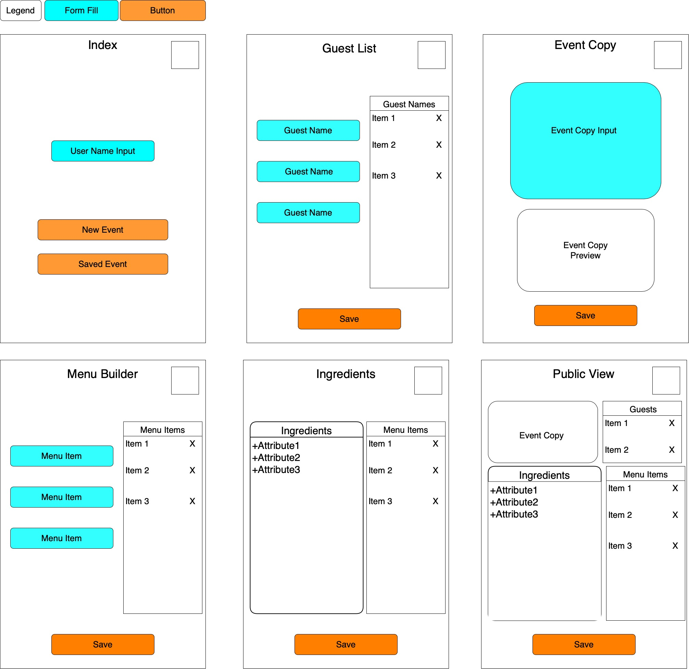

# 301-speakeasy
A space for our final Code Fellows 301 group project!

### Team Members
* Kai Hansen
* Kory Jackson
* Daniel Nguyen
* Brett Packard
* Thomas Sherer
 
## Elements still needed
- [ ] Project Summary
- [ ] Link to project board
- [ ] User Stories
- [x] Wireframes
- [ ] DOM model
- [ ] Database Entity-Relationship-Diagram
- [ ] Software requirements doc
- [x] Team Agreement

## Wireframes

## Team Agreement

**Communication plan:** Communication will primarily take place on Slack. If for whatever reason it is not possible to communicate through Slack, texting will be the backup option. If anything regarding the project requires a decision, it belongs in the group slack rather than in private messages between individuals. Team members all agree to message the PM from the previous day before class about the status of what they accomplished so the PM can adequately prepare for stand-ups. 

**Conflict plan:** The team agrees to solve conflict between people at the lowest level first if possible. If things escalate, the team agrees to involve a mediator, most likely another team member, to help resolve the conflict. When it comes to conflicts about tasks themselves, we agree to pursue what we can accomplish as well and as quickly as we can without compromising quality. 

**Work plan:** We plan to utilize GitHub Projects for planning and organizing tasks. People are columns. We will start sessions with sunrise. PMs should identify fallout. If someone is working on their strength, they should involve someone in the process that needs to strengthen their skills in that area. The ReadMe belongs to Daniel. 

**Git process:** The GIT flow is that the Master branch is gold but PROD is God. To push to PROD, 3 people must approve the merge request, but ONLY after they each fully test the code and make sure it is functioning properly. To push to Master, 3 people must approve the merge request. Testing is not necessary. The naming system is as follows:

PROD - version X.x.x

Master - version x.X.x

Working - version x.x.X

**Any thing else you feel is important:** Unless necessary during the last several days before final presentations, there are no expectations to complete work on the project aside from the assigned meeting times. The team agrees to try to finish the projects a day before presentations so there is adequate time to prepare for the presentations themselves. The team also understands that the time frames for expected responses on Slack will be between 5pm-10pm on Mondays-Fridays and between 7am-10pm on Saturdays and Sundays.

## Change Log

### Day 1 // 2020.02.17

**8:30pm:** We got a late start to discussion around project stuff. Spent 1 hour building out basic rules and guidelines for the group, independent of the actual project.

### Day 2 // 2020.02.18

**6:30pm:** We all met in a conference room to brainstorm ideas. We had several directions to take. Looks like the top contenders are an Adult Beverage App and a Text Analysis App. Took us about an hour to get to those after discussing pros/cons for our other ideas.

**7:45pm:** We have started putting together the skeleton of our project setup tasks. Going through and trying to refine our ideas such that they are formatted correctly to turn in project prep assignments.

**8:35pm:** We successfully pitched the food/drink app to John. He suggested that we reorient it to focus on party/potluck organizing. 

**8:55pm:** We settled on the team name Speakeasy! Setting up repo stuff now.

**9:10pm:** Project prep 1 and 2 are in. #3 being worked now. Now looking at doing #4.

### Day 3 // 2020.02.19

**6:30pm:** We have assembled and the tasks for the day are to get the DOM model and wireframes figured out. If we can get those two things really polished, then that should set us up nicely for the rest of the project. Even better if we actually get to coding. Kory unfortunately talked to his doctor and was told to stay home for another couple days. Hopefully he is feeling better by Saturday. We will loop him into our decision-making and jump on a conference call if he's feeling well enough.

**8:30pm:** We have iterated heavily on the wireframes and data flows. In this process, we have downsized lots of features in order to make MVP on time. Right now we are trying to figure out the data structure for all the different data objects we will be working with. This is proving to be much more complex than we thought it would be initially. Definitely getting into the weeds on this. We will have to build wireframes and domain model in another session.

**9:00pm:** We spoke to Cory and Leo. They helped us visualize the way we will need to structure the data. We will need to make many different SQL tables. Turns out this will be much more complicated than we thought. Brett and Thomas are trying to get something barebones deployed so we can at least have something living out there. Daniel has added our domain model and wireframes to a basic draw.io template. He will try to get those fleshed out before we meet for tomorrow’s session. Then we can begin proper coding.

### Day 4 // 2020.02.20

**5:00pm:** Got to class early to work on the wireframes. 

**6:20pm:** Wireframes have been added to the readme.

**6:30pm:** Starting work on domain modeling.
